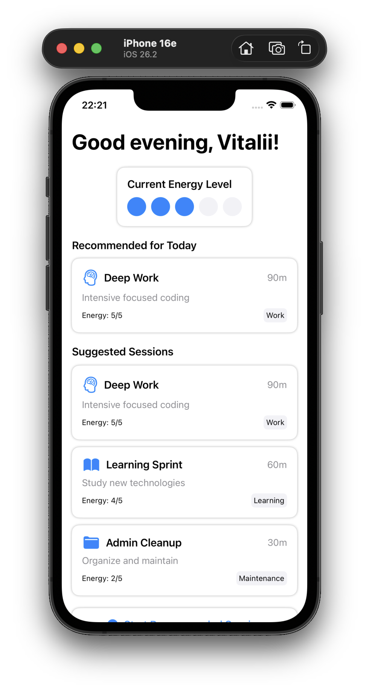
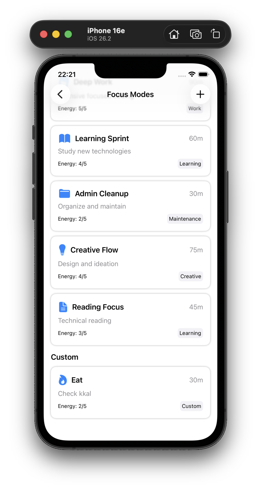
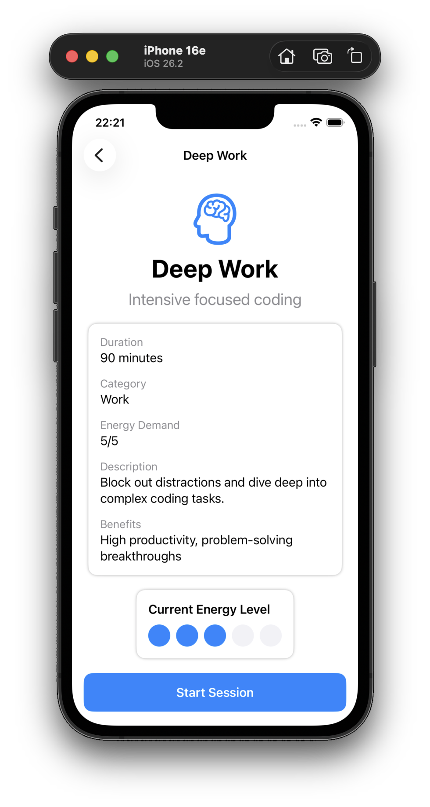
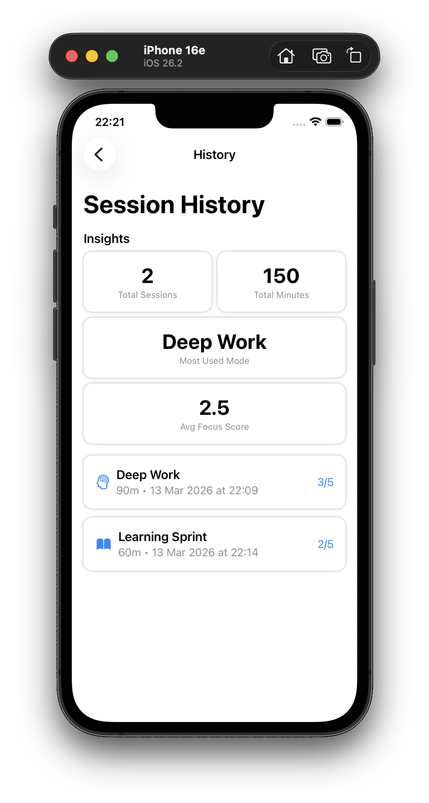
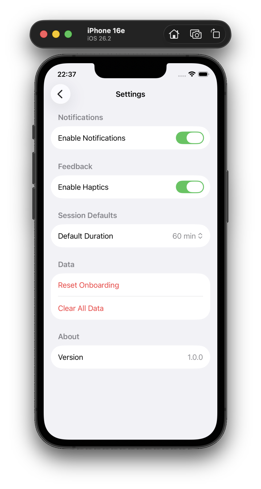

# FocusFuel

A productivity and wellbeing iOS app that helps users plan deep work sessions, track mental energy, and reflect after sessions.

## Architecture

The app follows MVVM (Model-View-ViewModel) architecture with clean separation of concerns:

- **Models**: Data structures like `FocusMode`, `FocusSession`, `UserSettings`
- **ViewModels**: Business logic for each screen (e.g., `HomeViewModel`, `ActiveSessionViewModel`)
- **Views**: SwiftUI views for UI presentation
- **Services**: Persistence layer using UserDefaults
- **Components**: Reusable UI components like `PrimaryButton`, `SessionCard`
- **Extensions**: Color extensions for consistent theming

## How to Run

1. Open the project in Xcode
2. Select a simulator or device
3. Build and run (Cmd+R)
4. Complete onboarding
5. Explore focus modes and start sessions

## Features

- Onboarding flow introducing the app
- Dashboard with energy tracking and recommendations
- Multiple focus modes (Deep Work, Learning, etc.)
- Create and save custom focus modes
- Active session timer with progress visualization
- Post-session reflection with focus and energy ratings
- Session history with lightweight insights
- Settings for customization

## Screenshots

  
  
  
  
  

## Tech Stack

- Swift 5.9+
- SwiftUI
- MVVM architecture
- UserDefaults for persistence
- No third-party dependencies

## AI Tool Used

- OpenAI Codex (GPT-5)

## Краткое описание

FocusFuel — iOS‑приложение для планирования фокус‑сессий, отслеживания энергии и короткой рефлексии после работы. В процессе использовался AI‑инструмент OpenAI Codex (GPT‑5) для ускорения разработки и проверки кода. На выполнение задания ушло примерно 6 часов с учетом проектирования, реализации и полировки интерфейса. Приложение полностью работает офлайн и использует локальное хранение данных.
